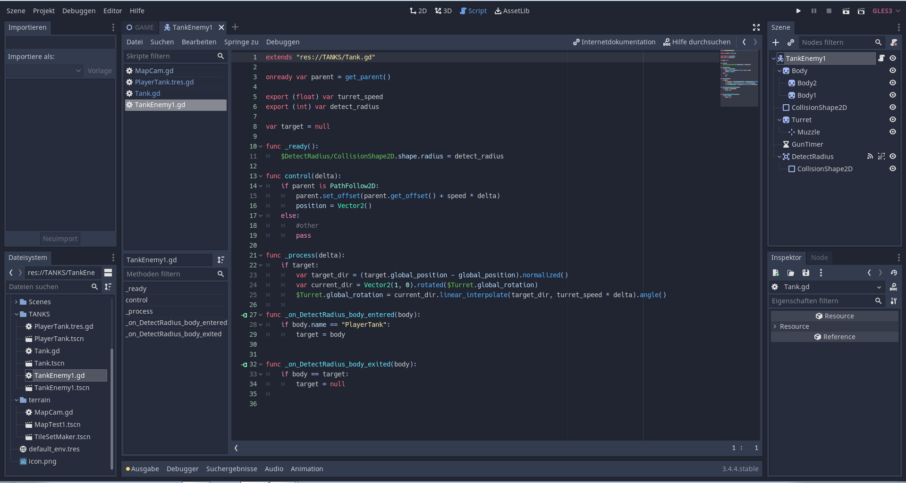

  <head>
    <link rel="stylesheet" href="design.css">
    <link rel="icon" type="image/png"
    href="Bilder/Symbol.png">
    <title>Ioannis Retoulas</title>
  </head>

  <body>
    <nav>
      <ul>
        <li class="Menu">
          <a href="#Home"> <strong>Über mich</strong></a>
        </li>
        <li class="Menu">
          <a href="#Lebenslauf"><strong>Lebenslauf</strong></a>
        </li>
        <li class="Menu">
          <a href="#Projekte"><strong>Projekte</strong></a>
        </li>
      </ul>
    </nav>

    <h1><section id="Home">Über mich</section></h1>
    

      
    

    

      

        Sehr geehrte Damen und Herren,    mein Name ist Ioannis Retoulas und
        das ist meine erste mit HTML programierte Webseite.
      

      

        Aktuell bin ich Teilnehmer im sechsmonatigen Berufsvorbereitungsprogramm der Joblinge gAG München.
        In Workshops und Trainings bereite ich mich gezielt auf meine Wunschausbildung vor.
        Mein Ziel bei JOBLINGE ist es, ein Unternehmen kennenzulernen,
        mich in der Praxis zu beweisen und mir dadurch einen Ausbildungsplatz zu erarbeiten.
      

      

        Erste berufliche Erfahrungen sammelte ich in meiner schulischen Ausbildung zum Fachpraktiker für Bürokommunikation
        bei der Bayrischen Landesschule (IHK) und meines einjährigen Nebenjobs als Verwaltungsassistent bei der Anderwerk GmbH.
        Hier konnte ich meine Zuverlässigkeit unter Beweis stellen und sammelte zudem Erfahrungen im Umgang mit Kunden.
        Durch mein großes Interesse für das Thema IT habe ich mich zu einem Berufswechsel entschlossen.
      

      

        Als Kind brachte mir mein älterer Bruder bei,
        wie man am Computer Hardwarekomponenten einbaut bzw. ersetzt.
        In der Schulzeit lernte ich,
        wie man Betriebssysteme installiert
        und in der Folgezeit konnte ich mein Wissen im Umgang mit Computern weiter ausbauen.
        Ich bringe sehr gute Hardwarekenntnisse mit und finde mich schnell mit der Arbeitsweise von neuen Programmen zurecht.
        Vor Kurzem habe ich einen Kurs für Python und HTML abgeschlossen.
        In meiner Freizeit vertiefe ich diese Kenntnisse und erstelle mein eigenes Spiel in Python.
        Aufgrund meiner Begeisterung für Computer möchte ich unbedingt eine Ausbildung zum Fachinformatiker starten.
      

      

        Zu meinen Stärken zählen meine schnelle Auffassungsgabe,
        gutes logisches Denkvermögen sowie technisches Verständnis.
        Zuverlässigkeit und Sorgfalt sind mir bei der Erledigung von Aufgaben wichtig.
        Darüber hinaus habe ich Freude an komplexen Aufgaben.
        Höflichkeit und gute Umgangsformen sind für mich selbstverständlich.
      

      

        Ich freue mich auf ein persönliches Gespräch, um mehr von Ihnen
        und den angebotenen Ausbildungsplatz zu erfahren.
        Gerne absolviere ich vorab ein Praktikum bei Ihnen.
      

    

    <h1><section id="Lebenslauf">Lebenslauf</section></h1>
      

        
      

    <h3>Persönliche Daten</h3>
      

        
Name:

        
Geburtsdatum, -ort:

        
Adresse:

        
Telefon:

        
E-Mail:

        
Staatsangehörigkeit:

      

      

        
Ioannis Retoulas

        
03.08.1997 in München

        
Riemer Straße 381, 81829 München

        
+49 (0) 157 35753608

        
Ioannis_Retoulas@outlook.de

        
Griechisch

      

    <h3>Schulbildung</h3>
      

        
11/2021 – Heute

        
12/2021

        
09/2020 – 07/2021

        
02/2020

        
09/2015 – 07/2017  

        
09/2014 – 07/2015

        
09/2011 – 07/2014

        
09/2007 – 07/2011

        
09/2004 – 07/2007

      

      

        
Teilnahme am Berufsvorbereitungsprogramm JOBLINGE, München

        
<strong>Mathe Urkunde</strong> von Mathe Meister.de

        
Münchner Volkshochschule, Abschluss: <strong>Mittlere Reife</strong>

        
Intensivkurs Englisch an der Münchner Volkshochschule

        
Staatliche Berufsfachschule an der Bayerischen Landesschule, 
        München, Abschluss: <strong>Fachpraktiker für Bürokommunikation (IHK)</strong>

        
Wirtschaftsschule der Bayerischen Landesschule, München

        
Bayerische Landesschule, München,
          Abschluss: <strong>Qualifizierender Mittelschulabschluss</strong>

        
Griechische Volksschule SOKRATES, München

        
Grundschule in München und Volos (Griechenland)

      

    <h3>Berufliche Erfahrung</h3>
      

        
02/2022 – 03/2022

        
06/2018 – 06/2019

        
09/2017 – 05/2018

        
06/2017 – 07/2017

        
10/2011

      

      

        
 IT Bootcamp von Azubi Digital Akademie (Python und HTML)

        
	Nebenjob als Verwaltungsassistent bei Fa. Anderwerk GmbH,
        Feldkirchen bei München

        
	Arbeitssuchend

        
	Praktikum in der Verwaltung bei Bayerische Akademie
          für Außenwirtschaft, München

        
	1-wöchiges Praktikum bei Munich Networks GmbH, München

      

    <h3>Kenntnisse & Fähigkeiten</h3>
      

        
Sprachen:    

        
EDV:    

      

      

        
Deutsch (Muttersprache)   Griechisch (Muttersprache)   Englisch (Schulkenntnisse)

        
MS Office-Paket (Fortgeschrittener Umgang)  
          Gute Kenntnisse in HTML und Python (Spielentwicklung)  
          Lexware (Routinierter Umgang)  
          Hardware (Gute Kenntnisse)

      

      <h3>Interessen</h3>
        <ul class="Aufzählung">
          <li>Naturwissenschaft</li>
          <li>Gaming</li>
          <li>Anime</li>
        </ul>

    

      
    

    <h1><section id="Projekte">Projekte</section></h1>
      

        
-Um die Programme zu testen, einfach auf das obere Play Symbol drücken.

        
-Wenn nach Zahlen gefragt wird, bitte nur ganze Zahlen eingeben.

      

    <h3>Einstellbarer Würfel</h3>
      

        <iframe src="https://trinket.io/embed/python/a57adc450f?toggleCode=true&runOption=run"
        width="80%" height="600" frameborder="0" marginwidth="0" marginheight="0" allowfullscreen></iframe>
      

    <h3>Zahlenratespiel</h3>
      

        <iframe src="https://trinket.io/embed/python/0d1eb07ce7?toggleCode=true&runOption=run"
         width="80%" height="600" frameborder="0" marginwidth="0" marginheight="0" allowfullscreen></iframe>
      

    <h3>Interaktiver Chat</h3>
      

        <iframe src="https://trinket.io/embed/python/ee0ea0c1f8?toggleCode=true&runOption=run"
        width="80%" height="600" frameborder="0" marginwidth="0" marginheight="0" allowfullscreen></iframe>
      

    <h3>Bild Generator</h3>
      

        <iframe src="https://trinket.io/embed/python/b11c4d941c?toggleCode=true&runOption=run"
        width="80%" height="600" frameborder="0" marginwidth="0" marginheight="0" allowfullscreen></iframe>
      

    <h3>Ausschnitte von mein Videospiel</h3>
    

      
    

    

      
    

    

      
    

  </body>
